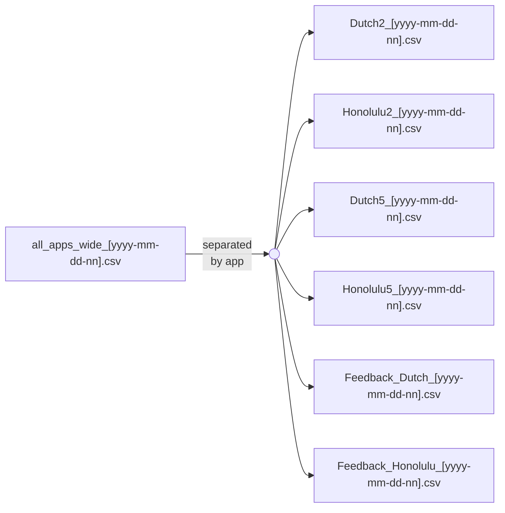

# Documentation For Replication Packages

## Prerequisites

You should have the following properly installed on your device:
- `Python`
- `Jupyter Notebook`
- Python packages
  - `matplotlib`
  - `numpy`
  - `pandas`
  - `scipy`
  - `scikit-learn`
  - `seaborn`
  - `statsmodels`

## Numerical Results

### Figure 1, Figure B.1-B.5

1. Open `Utility Difference.ipynb`.
2. Import packages and run section *Main Program*.
3. Run section *Computation* to generate numerical prediction data files (can take hours) `[n]_[aa]_[xxx].csv` where
  - `n` is the number of bidders
  - `aa` is the auction format where the Dutch auction is denoted by `da` and the Honolulu auction is denoted by `ha`
  - `xxx` is the predicted auction characteristic where `ED, ER, EUa, EUb` stands for the expected duration, selling price, utility for bidders, utility for the auctioneer respectively.
4. Run section *Relative difference* and adjust functional arguments to get
  - Figure 1
    - `graphPctHeatmap(eval_n=50, eval_interval=0.02, type="ED")`
    - `graphPctHeatmap(eval_n=50, eval_interval=0.02, type="ER")`
    - `graphPctHeatmap(eval_n=50, eval_interval=0.02, type="EUa")`
    - `graphPctHeatmap(eval_n=50, eval_interval=0.02, type="EUb")`
  - Figure B.2
    - `graphPctHeatmap2(eval_n=50, eval_interval=0.02, type="ED")`
  - Figure B.3
    - `graphPctHeatmap2(eval_n=50, eval_interval=0.02, type="ER")`
  - Figure B.4
    - `graphPctHeatmap2(eval_n=50, eval_interval=0.02, type="EUa")`
  - Figure B.5
    - `graphPctHeatmap2(eval_n=50, eval_interval=0.02, type="EUb")`
5. Run section *Jumps in the optimal starting price $s$* to get
  - Figure B.1

### Table B.1

1. Open `Fish_Auction.ipynb`.
2. Run section *Main program*.
3. Run section *Outputs for research use -> Table of concerned variables for parameters used in the experiment* to get
  - Table B.1
    - `table(a=1, b=0.45, c=0.95, list_n=[2, 5])` for columns 2L and 5L
    - `table(a=1, b=0.95, c=0.95, list_n=[2, 5])` for columns 2H and 5H

## Experimental Results

### Have all data files ready

#### Raw data 

The raw data of each experimental session is stored in `all_apps_wide_[yyyy-mm-dd-nn].csv`, where `yyyy-mm-dd` is the date of the session, `nn` is the session ID assigned by the experimenter. This all-in-one date file can be separated by app. Both formats of raw data are provided.

#### Process raw data

1. The following files should be put in the same folder:
  - `all_apps_wide_[yyyy-mm-dd-nn].csv`
  - `Data Reformat.ipynb`
2. Run `Data Reformat.ipynb` from the beginning to the second last section, change `str_date` accordingly for each session. You should get the following processed data files:
  - `all_apps_wide_[yyyy-mm-dd-nn].csv`
    - `Dutch_new_[yyyy-mm-dd-nn].csv`
    - `Honolulu_new_[yyyy-mm-dd-nn].csv`
      - `Honolulu_rounded_and_accurate_[yyyy-mm-dd-nn].csv`
    - `Feedback_Dutch_new_[yyyy-mm-dd-nn].csv`
    - `Feedback_Honolulu_new_[yyyy-mm-dd-nn].csv`
3. Merge these session-wide files manually to get the following all-session processed data files:
  - `Dutch_new_all_session.csv`
  - `Honolulu_new_all_session.csv`
    - `Honolulu_rounded_and_accurate_all_session.csv`
  - `Feedback_Dutch_new_all_session.csv`
  - `Feedback_Honolulu_new_all_session.csv`
4. Run the last section of `Data Reformat.ipynb` to get the final version of processed data files:
  - `Dutch_new_all_session.csv`
    - `Dutch_paydiff_norm.csv`
  - `Honolulu_new_all_session.csv`
    - `Honolulu_rounded_and_accurate_all_session.csv`
      - `Honolulu_paydiff_norm.csv`
  - `Feedback_Dutch_new_all_session.csv`
  - `Feedback_Honolulu_new_all_session.csv`

### Table 1

It's basic experimental design and session information. No codes are provided.

### Table 2, Table 5, Table D.1-D.3

1. Put the following files in the same folder:
  - `Dutch_paydiff_norm.csv`
  - `Honolulu_paydiff_norm.csv`
  - `Dominated behaviour.ipynb`
2. Open `Dominated behaviour.ipynb`.
3. Import packages and data files, then run section *Three price dynamics in Honolulu* to get
  - Table 2
    - "Actual" columns
      - `priceDynamics(rmin=3, rmax=30, tol=2, is_actual=True)`
    - "Predicted" columns
      - `priceDynamics(rmin=3, rmax=30, tol=2, is_actual=False)`
  - Table D.1
    - All treatments
      - `signedRankTest(rmin=3, rmax=30, tol=2, altH="greater", altD="less", altE="less")`
      - `signedRankTest(rmin=3, rmax=30, tol=2, altH="two-sided", altD="two-sided", altE="two-sided")`
    - 2-bidder
      - `signedRankTestByNumber(rmin=3, rmax=30, tol=2, n=2, altH="greater", altD="less", altE="less")`
      - `signedRankTestByNumber(rmin=3, rmax=30, tol=2, n=2, altH="two-sided", altD="two-sided", altE="two-sided")`
    - 5-bidder
      - `signedRankTestByNumber(rmin=3, rmax=30, tol=2, n=5, altH="greater", altD="less", altE="less")`
      - `signedRankTestByNumber(rmin=3, rmax=30, tol=2, n=5, altH="two-sided", altD="two-sided", altE="two-sided")`
    - 2H
      - `signedRankTestByTreatment(rmin=3, rmax=30, tol=2, n=2, b=0.019, altH="greater", altD="less", altE="less")`
      - `signedRankTestByTreatment(rmin=3, rmax=30, tol=2, n=2, b=0.019, altH="two-sided", altD="two-sided", altE="two-sided")` 
    - 2L
      - `signedRankTestByTreatment(rmin=3, rmax=30, tol=2, n=2, b=0.009, altH="greater", altD="greater", altE="less")`
      - `signedRankTestByTreatment(rmin=3, rmax=30, tol=2, n=2, b=0.009, altH="two-sided", altD="two-sided", altE="two-sided")`
    - 5H
      - `signedRankTestByTreatment(rmin=3, rmax=30, tol=2, n=5, b=0.019, altH="greater", altD="less", altE="less")`
      - `signedRankTestByTreatment(rmin=3, rmax=30, tol=2, n=5, b=0.019, altH="two-sided", altD="two-sided", altE="two-sided")` 
    - 5L
      - `signedRankTestByTreatment(rmin=3, rmax=30, tol=2, n=5, b=0.009, altH="greater", altD="less", altE="less")`
      - `signedRankTestByTreatment(rmin=3, rmax=30, tol=2, n=5, b=0.009, altH="two-sided", altD="two-sided", altE="two-sided")` 
4. Run section *SD & WD decisions* to get
  - Table 5, Table D.2
    - Dutch auction "Top" columns
      - `tableSD(n=2, b=0.019, rmin=3, rmax=30, qmin=0.501, qmax=1, tol=2)`
      - `tableSD(n=2, b=0.009, rmin=3, rmax=30, qmin=0.501, qmax=1, tol=2)`
      - `tableSD(n=5, b=0.019, rmin=3, rmax=30, qmin=0.501, qmax=1, tol=2)`
      - `tableSD(n=5, b=0.009, rmin=3, rmax=30, qmin=0.501, qmax=1, tol=2)`
    - Dutch auction "Bottom" columns
      - `tableSD(n=2, b=0.019, rmin=3, rmax=30, qmin=0, qmax=0.5, tol=2)`
      - `tableSD(n=2, b=0.009, rmin=3, rmax=30, qmin=0, qmax=0.5, tol=2)`
      - `tableSD(n=5, b=0.019, rmin=3, rmax=30, qmin=0, qmax=0.5, tol=2)`
      - `tableSD(n=5, b=0.009, rmin=3, rmax=30, qmin=0, qmax=0.5, tol=2)`
    - Honolulu auction "Top" columns
      - `tableWD(n=2, b=0.019, rmin=3, rmax=30, qmin=0.501, qmax=1, tol=2)`
      - `tableWD(n=2, b=0.009, rmin=3, rmax=30, qmin=0.501, qmax=1, tol=2)`
      - `tableWD(n=5, b=0.019, rmin=3, rmax=30, qmin=0.501, qmax=1, tol=2)`
      - `tableWD(n=5, b=0.009, rmin=3, rmax=30, qmin=0.501, qmax=1, tol=2)`
    - Honolulu auction "Bottom" columns
      - `tableWD(n=2, b=0.019, rmin=3, rmax=30, qmin=0, qmax=0.5, tol=2)`
      - `tableWD(n=2, b=0.009, rmin=3, rmax=30, qmin=0, qmax=0.5, tol=2)`
      - `tableWD(n=5, b=0.019, rmin=3, rmax=30, qmin=0, qmax=0.5, tol=2)`
      - `tableWD(n=5, b=0.009, rmin=3, rmax=30, qmin=0, qmax=0.5, tol=2)`
  - Table D.3
    - All treatments
      - `signedRankUndominatedDutch(rmax=30, tol=2, alt="greater")`
      - `signedRankUndominatedHonolulu(rmax=30, tol=2, altDB="greater", altCL="greater", altCB="greater", altEL="greater", altDrop="greater")`
    - 2-bidder
      - `signedRankUndominatedDutchByNumber(n=2, rmin=3, rmax=30, tol=2, alt="greater")`
      - `signedRankUndominatedHonoluluByNumber(n=2, rmin=3, rmax=30, tol=2, altDB="greater", altCL="greater", altCB="greater", altEL="greater", altDrop="greater")`
    - 5-bidder
      - `signedRankUndominatedDutchByNumber(n=5, rmin=3, rmax=30, tol=2, alt="greater")`
      - `signedRankUndominatedHonoluluByNumber(n=5, rmin=3, rmax=30, tol=2, altDB="greater", altCL="greater", altCB="greater", altEL="greater", altDrop="greater")`
    - 2H
      - `signedRankUndominatedDutchByTreatment(n=2, b=0.019, rmin=3, rmax=30, tol=2, alt="greater")`
      - `signedRankUndominatedHonoluluByTreatment(n=2, b=0.019, rmin=3, rmax=30, tol=2, altDB="greater", altCL="greater", altCB="greater", altEL="greater", altDrop="greater")`
    - 2L
      - `signedRankUndominatedDutchByTreatment(n=2, b=0.009, rmin=3, rmax=30, tol=2, alt="greater")`
      - `signedRankUndominatedHonoluluByTreatment(n=2, b=0.009, rmin=3, rmax=30, tol=2, altDB="greater", altCL="greater", altCB="greater", altEL="greater", altDrop="greater")`
    - 5H
      - `signedRankUndominatedDutchByTreatment(n=5, b=0.019, rmin=3, rmax=30, tol=2, alt="greater")`
      - `signedRankUndominatedHonoluluByTreatment(n=5, b=0.019, rmin=3, rmax=30, tol=2, altDB="greater", altCL="greater", altCB="greater", altEL="greater", altDrop="greater")`
    - 5L
      - `signedRankUndominatedDutchByTreatment(n=5, b=0.009, rmin=3, rmax=30, tol=2, alt="greater")`
      - `signedRankUndominatedHonoluluByTreatment(n=5, b=0.009, rmin=3, rmax=30, tol=2, altDB="greater", altCL="greater", altCB="greater", altEL="greater", altDrop="greater")`

### Table 3, Figure 3-4, Figure 7, Figure E.1

1. Put the following files in the same folder:
  - `Dutch_paydiff_norm.csv`
  - `Honolulu_paydiff_norm.csv`
  - `Zero-cost prediction.ipynb`
  - `Summary statistics.ipynb`
2. Open `Zero-cost prediction.ipynb` and run from the beginning to the end to generate two new data files in the same folder:
  - `Dutch_paydiff_norm_zerocost.csv`
  - `Honolulu_paydiff_norm_zerocost.csv`
3. Open `Summary statistics.ipynb`.
4. Import packages and data files, then run section *Auction characteristics* to get
  - Figure 3
    - Subsection *Efficiency*
  - Figure 4(a), Figure E.1
    - Subsection *Duration*
  - Figure 4(b)
    - Subsection *Revenue*
  - Figure 4(c)
    - Subsection *Bidder utility*
  - Figure 4(d)
    - Subsection *Auctioneer utility*
5. Run subsection *Bid deviation -> Top and bottom earners* to get
  - Figure 7
    - Left panel
      - `plotDbid()`
    - Right panel
      - `plotDstage()`

### Figure 5, Figure F.1

1. Put the following files in the same folder:
  - `Dutch_paydiff_norm.csv`
  - `Honolulu_paydiff_norm.csv`
  - `Test main effects.ipynb`
2. Open `Test main effects.ipynb`.
3. Import packages and data files, then run section *Clustering Based On Similarity* to get
  - Figure F.1
    - Subsection *K-means*
      - `plotCluster(2, 0.019, 3)`
      - `plotCluster(2, 0.009, 3)`
      - `plotCluster(5, 0.019, 3)`
      - `plotCluster(5, 0.009, 4)`
  - Figure 5
    - Subsection *Percentage paydiff distribution*

### Figure 10-11

1. Put the following files in the same folder:
  - `Feedback_Dutch_new_all_session.csv.csv`
  - `Feedback_Honolulu_new_all_session.csv.csv`
  - `Feedback plots.ipynb`
2. Open `Feedback plots.ipynb` and run from the beginning to the end to get
  - Figure 10
    - Section *Winner regret*
  - Figure 11
    - Section *loser regret*

### Table 4, Table C.1-C.2

1. Put the following files in the same folder:
  - `Dutch_paydiff_norm.csv`
  - `Honolulu_paydiff_norm.csv`
  - `Bootstrap estimation_auction characteristics.ipynb`
2. Open `Bootstrap estimation_auction characteristics.ipynb`.
3. Import packages and data files, then run section *Functions* for preparation.
4. Run section *Baseline Regression and Prediction* to get
  - Table C.1
    - "Auctioneer payoff" columns
      - Subsection *Auctioneer utility -> reg cost, 2 bidders*
      - Subsection *Auctioneer utility -> reg cost, 5 bidders*
    - "Buyer payoff" columns
      - Subsection *Bidder utility -> reg cost, 2 bidders*
      - Subsection *Bidder utility -> reg cost, 5 bidders*
    - "Efficiency" columns
      - Subsection *Efficiency -> reg cost, 2 bidders*
      - Subsection *Efficiency -> reg cost, 5 bidders*
      - Subsection *Efficiency -> pooled*
  - Table C.2
    - "Buyer payoff" columns
      - Subsection *Bidder utility -> reg bidders, high cost*
      - Subsection *Bidder utility -> reg bidders, low cost* 
    - "Auction duration" columns
      - Subsection *Auction duration -> reg bidders, high cost*
      - Subsection *Auction duration -> reg bidders, low cost* 
    - "Selling price" columns
      - Subsection *Selling price -> reg bidders, high cost*
      - Subsection *Selling price -> reg bidders, low cost* 
5. Run section *Blocked Bootstrap* to get  
  - Table 4 (double-check Stata results, bootstrap results are different because of different random seeds)
    - "Efficiency" rows
      - Subsection *Efficiency pooled -> H = D*
      - Subsection *Efficiency -> H = D (high cost) for 2 bidders, H = D (low cost) for 2 bidders*
      - Subsection *Efficiency -> H = D (high cost) for 5 bidders, H = D (low cost) for 5 bidders*
    - "Duration" rows
      - Subsection *Auction duration-> D > H (2 bidders) for high cost, D > H (5 bidders) for high cost*
      - Subsection *Auction duration-> D > H (2 bidders) for low cost, D > H (5 bidders) for low cost*
      - Subsection *Auction duration-> H/D (5 bidders) > H/D (2 bidders) for high cost*
      - Subsection *Auction duration-> H/D (5 bidders) > H/D (2 bidders) for low cost*
    - "Selling price" rows
      - Subsection *Selling price -> H/D (5 bidders) = 0.988 for high cost, H/D (2 bidders) = 0.917 for high cost*
      - Subsection *Selling price -> H/D (5 bidders) = 0.991 for low cost, H/D (2 bidders) = 1.011 for low cost*
    - "Auctioneer utility" rows
      - Subsection *Auctioneer utility -> H > D (2 bidders) for high cost, H > D (5 bidders) for high cost*
      - Subsection *Auctioneer utility -> H > D (2 bidders) for low cost, H > D (5 bidders) for low cost*
    - "Buyer utility" rows
      - Subsection **Bidder utility -> H > D (2 bidders) for high cost, H > D (5 bidders) for high cost*
      - Subsection **Bidder utility -> H > D (2 bidders) for low cost, H > D (5 bidders) for low cost*
      - Subsection *Bidder utility -> H/D (high cost) > H/D (low cost) for 2 bidders*
      - Subsection *Bidder utility -> H/D (5 bidders) < H/D (2 bidders) for high cost *
      - Subsection *Bidder utility -> H/D (5 bidders) < H/D (2 bidders) for low cost (mean and variance are not consistent)*

### Figure 7 p-values

1. Put the following files in the same folder:
  - `Dutch_paydiff_norm.csv`
  - `Honolulu_paydiff_norm.csv`
  - `Bootstrap estimation_individual behaviour.ipynb`
2. Open `Bootstrap estimation_individual behaviour.ipynb`.
3. Import packages.
4. Run section *Top-bottom Data* to get
  - Figure 7 p-values
    - Left panel
      - Subsection *Dutch auction bids*
    - Right panel
      - Subsection *Dutch stage bids*